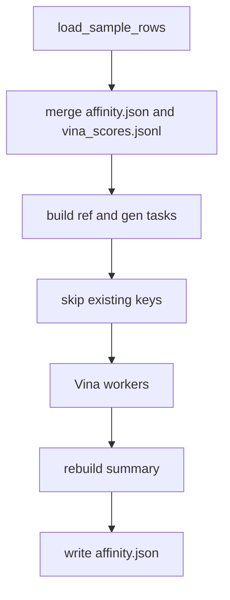
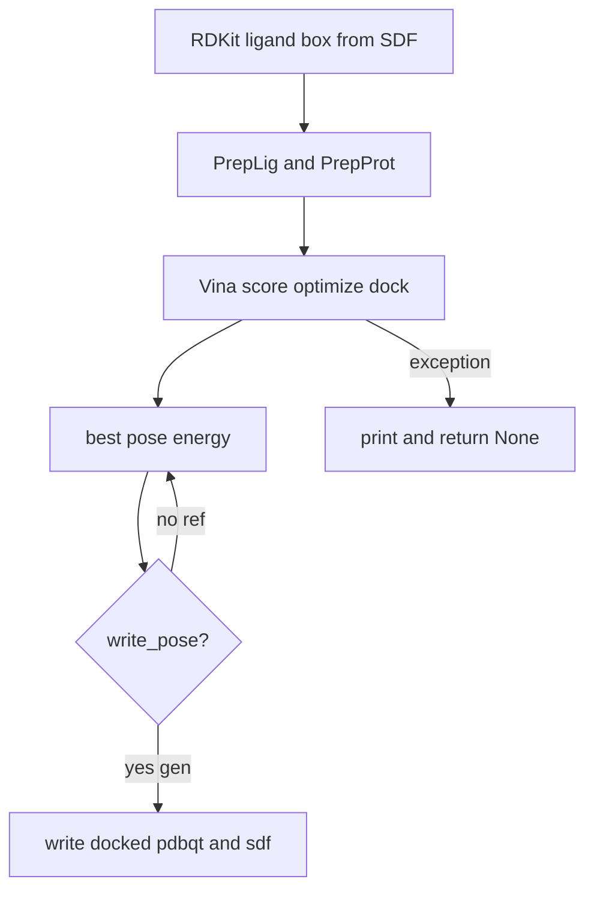

# Affinity (AutoDock Vina) workflow

Workflow of [`eval_affinity.py`](eval_affinity.py): load DONE PocketGen samples, dock each generated pocket and one native reference per complex with AutoDock Vina, then write mean / top-k / success-rate summaries. The protocol matches official [`generate_new.py`](../generate_new.py): 10 Å `{i}_relaxed.pdb`, box `size_factor=1.2` + `buffer=8.0`, exhaustiveness 64, 30 poses. The sampler ledger is not mutated.

## Overall pipeline

Load DONE rows, merge any previous scores, dock remaining tasks, then rebuild the summary over **all** samples.



- `load_sample_rows(sample_dir)` reads DONE payloads from the ResumableSaver ledger (`auto_recover=False`).
- Existing scores come from `affinity.json` (`per_sample` / `per_complex`) then `vina_scores.jsonl` (jsonl wins on the same key).
- One `ref::{cid}` task per complex (`ref_pocket_pdb` + `ref_ligand_sdf`), then one `gen::{cid}::{sid}` task per sample (`paths.pocket_relaxed` + `paths.ligand_sdf`).
- `--skip_existing` drops tasks whose key is already in the merged score map. Skip keys are `ref::{cid}` and `gen::{cid}::{sid}`, not `per_complex` as a dict.
- Workers run serially if `--num_workers <= 1`, else `multiprocessing.Pool` with `imap_unordered`. Each result is appended to `vina_scores.jsonl` immediately.
- The summary JSON is always rebuilt over the full score map, including skipped tasks.

## Per-task dock

Each worker `chdir`s into its tmp dir because `PrepLig.addH` writes `tmp_h.sdf` in the current working directory.



- Box center is the ligand centroid. Box size is `(max − min) * 1.2 + 8.0` per axis.
- Protein prep: `pdb2pqr30 --ff=AMBER` then AutoDockTools `prepare_receptor4.py`.
- Score reported is `v.energies(n_poses=1)[0][0]` (kcal/mol; lower is better).
- Generated tasks set `write_pose=True` and write `{pocket}_docked.pdbqt` / `{pocket}_docked.sdf` next to the relaxed pocket PDB. Reference docks do not write poses.
- Any exception prints `Vina failed for …` and stores `vina: null`.

## How to run

Activate the PocketGen environment and run from the PocketGen repo root.

```bash
python reproduction/eval_affinity.py \
  --sample_dir reproduction/outputs/crossdocked_sample \
  --skip_existing
```

| Flag | Default | Role |
| --- | --- | --- |
| `--sample_dir` | `reproduction/outputs/crossdocked_sample` | Sampler output dir (ledger + PDB/SDF) |
| `--tmp_dir` | `reproduction/tmp` | Per-task Vina work dirs |
| `--out_json` | `{sample_dir}/affinity.json` | Final summary JSON |
| `--exhaustiveness` | `64` | Vina exhaustiveness |
| `--n_poses` | `30` | Poses generated; score uses the best one |
| `--num_workers` | `8` | Parallel docks (`<= 1` is serial) |
| `--skip_existing` | off | Skip keys already in `affinity.json` / `vina_scores.jsonl` |

To recompute everything, delete `vina_scores.jsonl` and `affinity.json`.

## Inputs and outputs

Inputs per DONE sample row:

- Generated: `{complex_id}/{i}_relaxed.pdb` and `{complex_id}/{i}.sdf`
- Reference (once per complex): native pocket PDB and ligand SDF from the dataset (`ref_pocket_pdb`, `ref_ligand_sdf`)

Outputs under `--sample_dir`:

- `vina_scores.jsonl` — crash-safe append `{key, vina}` after each dock
- `affinity.json` — `summary`, `per_complex`, `per_sample` (copies `aar` / `rmsd` from the sample row)
- `{complex_id}/{i}_relaxed_docked.pdbqt` and `{complex_id}/{i}_relaxed_docked.sdf` for generated tasks only

[`aggregate_metrics.py`](aggregate_metrics.py) reads `affinity.json`.

## Metrics

Lower Vina is better. Local `mean_std` is variation **within one sampling run**, not the paper `±` over three training runs.

| Field | Definition |
| --- | --- |
| `vina` | Mean ± std over all scored generated samples |
| `ref_vina` | Mean ± std of per-complex reference scores |
| `top1_vina` / `top3_vina` / `top5_vina` / `top10_vina` | Per complex: mean of the k lowest gen scores; then mean ± std across complexes |
| `success_rate_pocket` | Fraction of gen samples with `vina < ref_vina` |
| `success_rate_protein` | Fraction of complexes whose best gen score beats the reference |
| `n_samples_scored` / `n_complexes` | Counts used in the summary |

Paper targets used by the aggregator: Vina `-7.135 ± 0.08`, success rate `~97%`.
