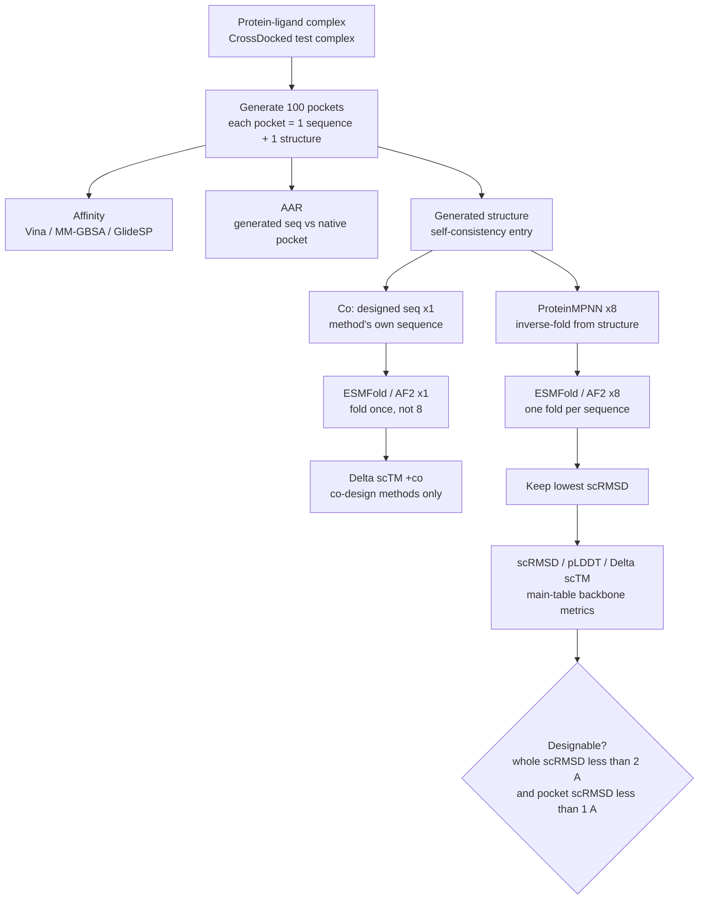
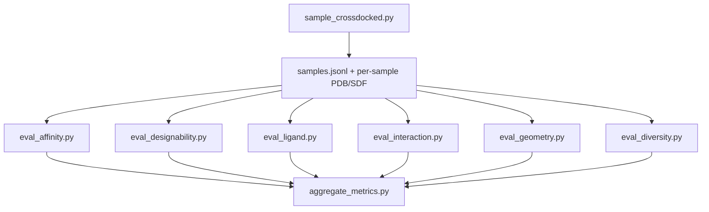

# PocketGen CrossDocked reproduction

Scripts in this folder sample PocketGen on the **CrossDocked test set** with the official pretrained checkpoint, then compute open-source evaluation metrics. They do not modify upstream `generate_new.py` or `utils/relax.py`.

Default protocol: **100 test complexes × 100 pockets** per complex (temperature τ = 3.0).

## Scope

**In scope**

- CrossDocked test split only
- Sampling + AAR, AutoDock Vina (mean / top-k / success rate)
- Designability with ESMFold (`scRMSD`, `scTM`, `pLDDT`, `ΔscTM`)
- PoseBusters, PLIP interaction recovery, geometry KL, sequence diversity

**Out of scope**

- Binding MOAD
- MM-GBSA, GlideSP
- AlphaFold 2 folding
- Three independent training runs (paper `±`); this folder uses one official checkpoint and one sampling seed by default

## Paper metrics vs this folder

| Paper | This folder |
| --- | --- |
| Vina, top-k Vina, success rate | [`eval_affinity.py`](eval_affinity.py) |
| AAR | Written into `samples.jsonl` during sampling |
| Designability / scRMSD / scTM / pLDDT / ΔscTM | [`eval_designability.py`](eval_designability.py) (ESMFold; default `--sequence_source codesign`) |
| PoseBusters | [`eval_ligand.py`](eval_ligand.py) |
| PLIP interactions | [`eval_interaction.py`](eval_interaction.py) |
| Bond / dihedral KL | [`eval_geometry.py`](eval_geometry.py) |
| Diversity (1 − mean pairwise identity) | [`eval_diversity.py`](eval_diversity.py) |
| Aggregate summary | [`aggregate_metrics.py`](aggregate_metrics.py) |
| MM-GBSA, GlideSP, AF2, Binding MOAD, 3× retrain `±` | Not implemented |

## Evaluation flow (paper)

PocketGen evaluation has three metric groups:

- **Affinity**: Vina (this folder); MM-GBSA / GlideSP (paper only)
- **Self-consistency / structural validity**: scRMSD, scTM, pLDDT, designability
- **Sequence recovery**: AAR

**100** and **8** are different stages:

- **100**: PocketGen (or a baseline) generates 100 pockets per complex. Each pocket is **one sequence + one structure**.
- **8**: For the shared backbone self-consistency protocol, ProteinMPNN proposes **8** sequences from each **generated structure**; each is refolded; only the lowest scRMSD is kept.

PocketGen itself does **not** design eight sequences. The MPNN×8 path is a shared evaluation protocol for generated backbones (including PocketGen). The **Co** path uses the method’s own designed sequence once and is reported in the paper as `ΔscTM (+co)`.



How this maps to [`eval_designability.py`](eval_designability.py):

| Flag | Paper alignment |
| --- | --- |
| `--sequence_source codesign` (default) | Co path / `ΔscTM (+co)` using the generated sequence |
| `--sequence_source proteinmpnn` | Shared MPNN×8 backbone protocol (main-table scRMSD / pLDDT / ΔscTM style) |

This folder folds with **ESMFold** only (closer to paper Table S2 than Table 1 AF2).

## Practical pipeline



## How to run

Activate the PocketGen environment and run from the PocketGen repo root.

```bash
micromamba activate pocketgen
cd /path/to/PocketGen
```

### 1. Sample (resumable)

```bash
python reproduction/sample_crossdocked.py \
  --num_samples 100 \
  --out_dir reproduction/outputs/crossdocked_sample
```

Useful options: `--max_complexes`, `--start_index`, `--batch_size`, `--temperature`, `--seed`, `--ckpt`, `--device`.

Resume with the same `--out_dir`. Complexes already fully recorded in `samples.jsonl` are skipped; a partial complex continues from `max(already) + 1`. Failed batches are appended to `failures.jsonl` and sampling continues.

Outputs under each complex directory include `{i}.pdb`, `{i}_relaxed.pdb`, `{i}_whole.pdb`, `{i}_whole_relaxed.pdb`, and `{i}.sdf`.

### 2. Affinity (Vina)

```bash
python reproduction/eval_affinity.py \
  --sample_dir reproduction/outputs/crossdocked_sample \
  --skip_existing
```

Uses the official-style **10 Å fragment** `{i}_relaxed.pdb`. Default exhaustiveness is 64.

### 3. Designability (ESMFold)

Requires Genie-side helpers: default TMscore at `../genie/packages/TMscore/TMscore`, plus ESMFold (and ProteinMPNN for the MPNN path).

```bash
# Co path (default): generated sequence
python reproduction/eval_designability.py \
  --sample_dir reproduction/outputs/crossdocked_sample \
  --sequence_source codesign

# Shared backbone protocol: ProteinMPNN x8
python reproduction/eval_designability.py \
  --sample_dir reproduction/outputs/crossdocked_sample \
  --sequence_source proteinmpnn \
  --out_json reproduction/outputs/crossdocked_sample/designability_mpnn.json
```

### 4. Optional metrics

```bash
python reproduction/eval_ligand.py --sample_dir reproduction/outputs/crossdocked_sample
python reproduction/eval_interaction.py --sample_dir reproduction/outputs/crossdocked_sample
python reproduction/eval_geometry.py --sample_dir reproduction/outputs/crossdocked_sample
python reproduction/eval_diversity.py --sample_dir reproduction/outputs/crossdocked_sample
```

Optional deps: `posebusters`, PLIP CLI.

### 5. Aggregate

```bash
python reproduction/aggregate_metrics.py \
  --sample_dir reproduction/outputs/crossdocked_sample
```

Writes `summary.json` / `summary.txt` from whatever metric JSON files are present.

## Implementation notes

- **AAR** is computed on **3.5 Å designed residues**, not the full 10 Å pocket crop.
- **Vina** docks against `{i}_relaxed.pdb` (10 Å fragment), matching official `generate_new.py`. Designability uses whole-protein PDBs.
- **OpenMM**: [`sample_crossdocked.py`](sample_crossdocked.py) monkeypatches `openmm_relax` on both `utils.relax` and `models.PD` (PD binds the symbol at import). The patch clears PDBFixer `missingResidues` on discontinuous pocket fragments and copies the unrelaxed PDB to `{stem}_relaxed.pdb` if minimization fails.
- **Paper `±`**: mean ± std over **three independent training runs** with different seeds. Local `mean_std` is variation **within one sampling run**, not the paper `±`.
- **Table 1 / S2 top-k designability** (rank pockets by Vina, then average structure metrics on top-1/3/5/10) is **not** auto-aggregated here. [`eval_affinity.py`](eval_affinity.py) reports top-k **Vina** only.

## Script index

| Script | Role |
| --- | --- |
| [`sample_crossdocked.py`](sample_crossdocked.py) | Sample test set; write PDB/SDF + `samples.jsonl` |
| [`eval_affinity.py`](eval_affinity.py) | AutoDock Vina |
| [`eval_designability.py`](eval_designability.py) | ESMFold self-consistency / designability |
| [`eval_ligand.py`](eval_ligand.py) | PoseBusters |
| [`eval_interaction.py`](eval_interaction.py) | PLIP |
| [`eval_geometry.py`](eval_geometry.py) | Backbone / side-chain geometry KL |
| [`eval_diversity.py`](eval_diversity.py) | Sequence diversity |
| [`aggregate_metrics.py`](aggregate_metrics.py) | Combine metric JSONs |
| [`common.py`](common.py) | Shared helpers |

## Reference

Zhang et al., *Efficient generation of protein pockets with PocketGen*, Nature Machine Intelligence, 2024.  
https://doi.org/10.1038/s42256-024-00920-9
