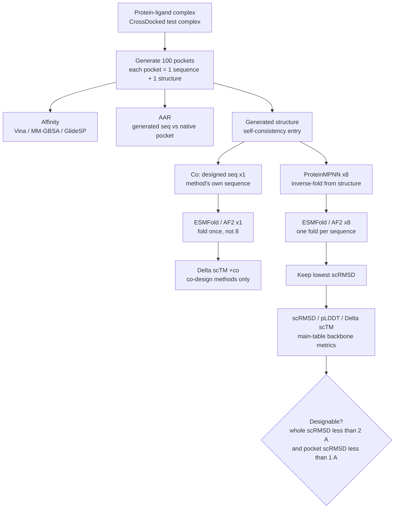
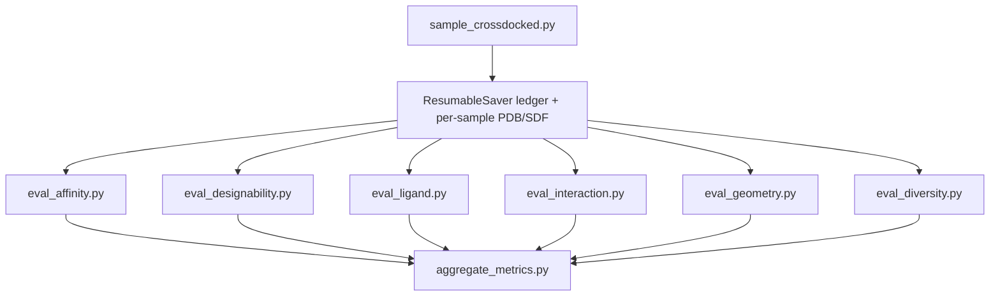

# PocketGen CrossDocked reproduction

Scripts in this folder sample PocketGen on the **CrossDocked test set** with the official pretrained checkpoint, then compute open-source evaluation metrics. They do not modify upstream `generate_new.py` or `utils/relax.py`.

Default protocol: **100 test complexes × 100 pockets** per complex (temperature τ = 3.0).

## Scope

**In scope**

- CrossDocked test split only
- Sampling + AAR, AutoDock Vina (mean / top-k / success rate)
- Designability with ESMFold (`scRMSD`, `scTM`, `pLDDT`, `ΔscTM`)
- PoseBusters, PLIP interaction recovery, geometry KL, sequence diversity

**Out of scope**

- Binding MOAD
- MM-GBSA, GlideSP
- AlphaFold 2 folding
- Three independent training runs (paper `±`); this folder uses one official checkpoint and one sampling seed by default

## Paper metrics vs this folder

| Paper | This folder |
| --- | --- |
| Vina, top-k Vina, success rate | [`eval_affinity.py`](eval_affinity.py) |
| AAR | Stored in ResumableSaver DONE payloads during sampling |
| Designability / scRMSD / scTM / pLDDT / ΔscTM | [`eval_designability.py`](eval_designability.py) (ESMFold; default `--sequence_source proteinmpnn`) |
| PoseBusters | [`eval_ligand.py`](eval_ligand.py) |
| PLIP interactions | [`eval_interaction.py`](eval_interaction.py) |
| Bond / dihedral KL | [`eval_geometry.py`](eval_geometry.py) |
| Diversity (1 − mean pairwise identity) | [`eval_diversity.py`](eval_diversity.py) |
| Aggregate summary | [`aggregate_metrics.py`](aggregate_metrics.py) |
| MM-GBSA, GlideSP, AF2, Binding MOAD, 3× retrain `±` | Not implemented |

## Evaluation flow (paper)

PocketGen evaluation has three metric groups:

- **Affinity**: Vina (this folder); MM-GBSA / GlideSP (paper only)
- **Self-consistency / structural validity**: scRMSD, scTM, pLDDT, designability
- **Sequence recovery**: AAR

**100** and **8** are different stages:

- **100**: PocketGen (or a baseline) generates 100 pockets per complex. Each pocket is **one sequence + one structure**.
- **8**: For the shared backbone self-consistency protocol, ProteinMPNN proposes **8** sequences from each **generated structure**; each is refolded; only the lowest scRMSD is kept.

PocketGen itself does **not** design eight sequences. The MPNN×8 path is a shared evaluation protocol for generated backbones (including PocketGen). The **Co** path uses the method’s own designed sequence once and is reported in the paper as `ΔscTM (+co)`.



How this maps to [`eval_designability.py`](eval_designability.py):

| Flag | Paper alignment |
| --- | --- |
| `--sequence_source proteinmpnn` (default) | Main protocol: ProteinMPNN×8 + ESMFold, keep lowest scRMSD. This is Fig. 2 / GitHub README designability 0.77 and Table S2-style scRMSD / pLDDT / ΔscTM. |
| `--sequence_source codesign` | Co add-on only: fold the model's own sequence once. Use for Table 1 `ΔscTM (+co)`, not the main designability number. |

This folder folds with **ESMFold** only. That matches Table S2, **not** Table 1 (AF2). Do not compare ESMFold scTM / ΔscTM to Table 1 AF2 numbers.

## Practical pipeline



## How to run

Run all commands from the PocketGen repo root.

One-time environments:

```bash
bash prepare.sh
bash reproduction/shell/set_up_genie.sh
```

`prepare.sh` creates `pocketgen` (Python 3.8, PyTorch 1.13.1+cu117). `set_up_genie.sh` clones that env to `eval` (conda packages only; micromamba clone omits pip), reinstalls the PocketGen pip + PyG cu117 stack, then overlays ProteinMPNN, ESMFold-era openfold, and TMscore without replacing torch. An existing `eval` that is not this clone is removed and recreated.

| Step | Environment |
| --- | --- |
| Sampling, Vina, PoseBusters, PLIP, geometry, diversity | `pocketgen` or `eval` (same PocketGen stack after pip/PyG reinstall) |
| Designability (`eval_designability.py`) | `eval` only |

```bash
cd /path/to/PocketGen
micromamba activate pocketgen   # sampling / affinity / ligand / ...
# or: micromamba activate eval  # required for designability
```

### 1. Sample (resumable)

```bash
python reproduction/sample_crossdocked.py \
  --num_samples 100 \
  --out_dir reproduction/outputs/crossdocked_sample
```

Useful options: `--max_complexes`, `--start_index`, `--batch_size`, `--temperature`, `--seed`, `--ckpt`, `--device`.

Resume with the same `--out_dir`. Progress lives in `manifest.db` (SQLite) and DONE payloads under `outputs/{shard}/{sample_id}.pkl` (readable keys such as `{complex_id}::{i}`). Missing or checksum-mismatched pickles are reset to `pending` on sampler start (`retry_failed=True`). Remaining sample ids are split into **consecutive runs**, then chunked by `--batch_size` (effective size ≤ `batch_size`) so upstream `generate_id + n` file names stay aligned. A failed `generate()` marks every id in that chunk as `failed` and continues. If OpenMM minimization fails, the unrelaxed PDB is copied and the sample payload records `relax_fallback: true`.

Outputs under each complex directory include `{i}.pdb`, `{i}_relaxed.pdb`, `{i}_whole.pdb`, `{i}_whole_relaxed.pdb`, and `{i}.sdf`. Eval scripts load DONE rows via `load_sample_rows()` (they do not mutate the ledger).

### 2. Affinity (Vina)

Workflow details: [`eval_affinity.md`](eval_affinity.md).

```bash
python reproduction/eval_affinity.py \
  --sample_dir reproduction/outputs/crossdocked_sample \
  --skip_existing
```

Uses the official-style **10 Å fragment** `{i}_relaxed.pdb`. Default exhaustiveness is 64.

`--skip_existing` **merges** previous `affinity.json` with `vina_scores.jsonl` (crash-safe append after each dock) and rebuilds the full summary over **all** samples. Skip keys use `per_complex[].complex_id`; they do not iterate `per_complex` as a dict. To recompute everything, delete `vina_scores.jsonl` and `affinity.json`.

### 3. Designability (ESMFold, resumable)

Requires the `eval` env from [`shell/set_up_genie.sh`](shell/set_up_genie.sh), plus Genie-side helpers: default TMscore at `../genie/packages/TMscore/TMscore`, ESMFold, and ProteinMPNN.

Default is **ProteinMPNN×8** (main paper / README 0.77 protocol). Writes `designability.json` (what [`aggregate_metrics.py`](aggregate_metrics.py) reads) and `designability.jsonl`. Reruns skip `(complex_id, sample_id)` already in the jsonl and rebuild the summary JSON at the end.

```bash
micromamba activate eval

# Main protocol: ProteinMPNN x8 + ESMFold, keep lowest scRMSD
python reproduction/eval_designability.py \
  --sample_dir reproduction/outputs/crossdocked_sample

# Co add-on only: model's own sequence once (Delta scTM +co)
python reproduction/eval_designability.py \
  --sample_dir reproduction/outputs/crossdocked_sample \
  --sequence_source codesign
```

The Co path writes `designability_codesign.json` / `designability_codesign.jsonl` so it does not overwrite the main MPNN summary.

### 4. Optional metrics

```bash
python reproduction/eval_ligand.py --sample_dir reproduction/outputs/crossdocked_sample
python reproduction/eval_interaction.py --sample_dir reproduction/outputs/crossdocked_sample
python reproduction/eval_geometry.py --sample_dir reproduction/outputs/crossdocked_sample
python reproduction/eval_diversity.py --sample_dir reproduction/outputs/crossdocked_sample
```

Optional deps: `posebusters`, PLIP CLI.

### 5. Aggregate

```bash
python reproduction/aggregate_metrics.py \
  --sample_dir reproduction/outputs/crossdocked_sample
```

Writes `summary.json` / `summary.txt` from whatever metric JSON files are present. Missing groups print `-`.

To report only finished groups (skips unread eval JSONs and, unless `aar`/`rmsd` is requested, the sample ledger):

```bash
python reproduction/aggregate_metrics.py \
  --sample_dir reproduction/outputs/crossdocked_sample \
  --metrics aar,vina
```

`--metrics` accepts comma- or space-separated names: `aar`, `rmsd`, `affinity` (alias `vina`), `designability`, `ligand` (alias `posebusters`), `interaction`, `geometry`, `diversity`. Default is all groups. A subset still writes `summary.json`; use `--out_json` for a peek file if you do not want to overwrite a later full summary.

## Implementation notes

- **AAR** is computed on **3.5 Å designed residues**, not the full 10 Å pocket crop.
- **Vina** docks against `{i}_relaxed.pdb` (10 Å fragment), matching official `generate_new.py`. Designability uses whole-protein PDBs. Pocket scRMSD / pLDDT on ESMFold PDBs use **ordinal residue indices** (ESMFold is numbered 1..L), not crystal `designed_resseq`.
- **OpenMM**: [`sample_crossdocked.py`](sample_crossdocked.py) monkeypatches `openmm_relax` on both `utils.relax` and `models.PD` (PD binds the symbol at import). The patch clears PDBFixer `missingResidues` on discontinuous pocket fragments and copies the unrelaxed PDB to `{stem}_relaxed.pdb` if minimization fails (`relax_fallback` on the sample row).
- **Resume ledger**: [`utils/resumable_saver.py`](utils/resumable_saver.py) tracks `pending` / `done` / `failed`. Sampling never feeds gapped id lists into one `generate()` call; consecutive-run chunking keeps file names and sample ids aligned.
- **Paper `±`**: mean ± std over **three independent training runs** with different seeds. Local `mean_std` is variation **within one sampling run**, not the paper `±`.
- **Table 1 / S2 top-k designability** (rank pockets by Vina, then average structure metrics on top-1/3/5/10) is **not** auto-aggregated here. [`eval_affinity.py`](eval_affinity.py) reports top-k **Vina** only.

## Script index

| Script | Role |
| --- | --- |
| [`shell/set_up_genie.sh`](shell/set_up_genie.sh) | Clone `eval` from `pocketgen`; overlay ProteinMPNN / ESMFold / TMscore |
| [`sample_crossdocked.py`](sample_crossdocked.py) | Sample test set; write PDB/SDF + ResumableSaver ledger |
| [`utils/resumable_saver.py`](utils/resumable_saver.py) | SQLite resume ledger for sample payloads |
| [`eval_affinity.py`](eval_affinity.py) | AutoDock Vina |
| [`eval_designability.py`](eval_designability.py) | ESMFold self-consistency / designability |
| [`eval_ligand.py`](eval_ligand.py) | PoseBusters |
| [`eval_interaction.py`](eval_interaction.py) | PLIP |
| [`eval_geometry.py`](eval_geometry.py) | Backbone / side-chain geometry KL |
| [`eval_diversity.py`](eval_diversity.py) | Sequence diversity |
| [`aggregate_metrics.py`](aggregate_metrics.py) | Combine metric JSONs |
| [`common.py`](common.py) | Shared helpers (`load_sample_rows`) |

## Reference

Zhang et al., *Efficient generation of protein pockets with PocketGen*, Nature Machine Intelligence, 2024.  
https://doi.org/10.1038/s42256-024-00920-9
