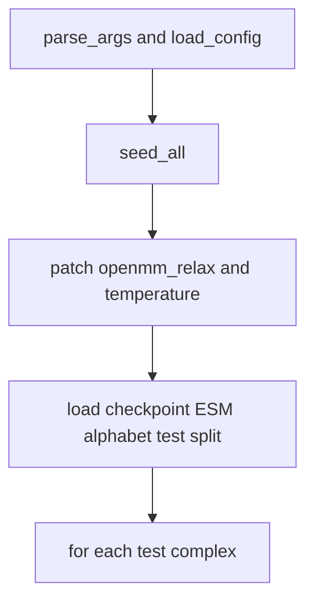
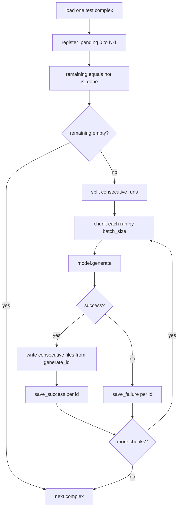

# Sample CrossDocked workflow

Workflow of [`sample_crossdocked.py`](sample_crossdocked.py): load the official checkpoint, walk the CrossDocked test split, write pocket/ligand files, and store AAR/RMSD rows in a ResumableSaver ledger (`manifest.db` + pickles).

## Overall pipeline

Setup runs once. Then each test complex is sampled.

## Per-complex loop

`--batch_size 4` means up to four independent pockets of the **same** complex in one `model.generate()` call, not four different complexes.

- Register `0 .. num_samples-1` as pending in the saver.
- `remaining`: sample ids that are not `DONE`.
- Split `remaining` into consecutive runs, then chunk each run by `batch_size` (effective size is variable and ≤ `batch_size`).
- Each chunk sets `generate_id = sample_ids[0]` and calls `model.generate`.
- Success: PDB/SDF on disk + `save_success` payload.
- Failure: `save_failure` for every id in the chunk, then continue.

## Notes

Default protocol: 100 test complexes × 100 pockets per complex. With `batch_size=4` on a full remaining list that is about 25 `generate()` calls per complex.

Upstream `to_pdb` / `to_sdf` only write `generate_id + n`. Consecutive-run chunking keeps each batch equal to `range(sample_ids[0], sample_ids[0] + len(sample_ids))`, so file names stay aligned with ledger sample ids.

Ledger layout under `--out_dir`:

- `manifest.db` — SQLite statuses (`pending` / `done` / `failed`)
- `outputs/{shard}/{sample_id}.pkl` — DONE sample payloads (metrics + paths); keys like `{complex_id}::{i}`
- `{complex_id}/{i}.pdb` and related SDF/PDB files — structure side effects for eval
